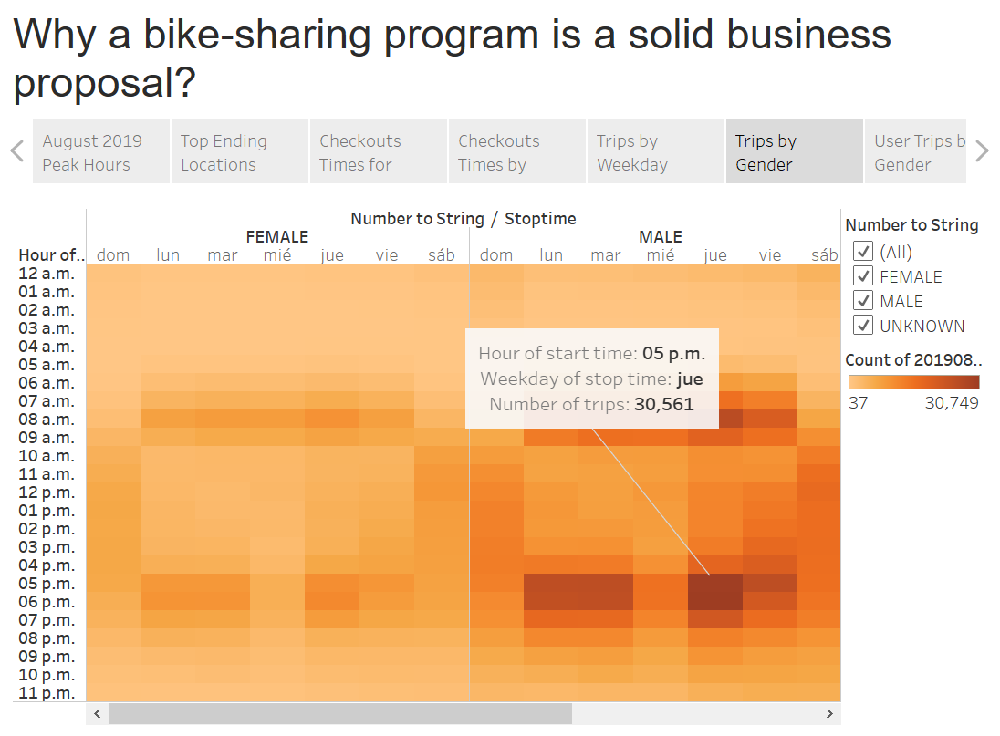

# bikesharing

## Overview
The project is about how we could start a similar New York City bike share business in Des Moines, Iowa, which would allow people to know the city and interact with who live there and who are using bikes for their commutes. The mechanics of making this business work might be quite different in Des Moines than in New York City. The first step is to figure out how the bike-share business works in New York City with the data analysis of Citi Bike bike-sharing program and the development of a business story in Tableau, and then create a proposal on how it might work in Des Moines.

## Resources
  - Framework: Python 3.9.7, Jupyter Notebook and Pandas 1.2.4
  - Datasource: 201908-citibike-tripdata.csv from [Citi Bike Trip Histories](https://ride.citibikenyc.com/system-data)
  - Visual analytics platform: Tableau Public 2021.4.1

## Results
We created a story that explains why we think, given the data, that starting a bike sharing company in Des Moines is a good idea: [Link to dashboard](https://public.tableau.com/app/profile/david.ortega.segura/viz/citibike_16401910386320/Citibike)

**August 2019 Peak Hours**

The analysis of the data bike-sharing program in New York City in August 2019 showcases that all-day the service is requested, no matter the hours. At 8.00 am, there is the peak service request, around 170,730 trips. The highest service request is between 17:00 and 18:00 hours, 224,566 and 215,783 trips, respectively.

**Top Ending Locations**

The station's location showcase you could have a bike trip everywhere to know the city and interact with the people who live there. For instance, the top start and end locations are around China Town and Lower Manhattan but there are activities in all stations in New York City.

**Checkout Times for Users**

Checkout times for users showcases that the peak trip duration is 5.25 minutes with 146,132 bikes. Inclusive, there are trips almost 24 hours with three bikes.

**Checkout Times by Gender**

The checkout times peak by male gender is 4.28 minutes with 107,152 bikes, while female gender is 5.74 minutes with 34,190 bike, and by unknown gender is 10.83 minutes with 7,850 bikes.

**Trips by Weekday for Each Hour**

The number of bike trips by weekday for each hour of the day showcases bike-sharing as one of the favorite types of green transportation. Thursday is the weekday with the most service request of 44,905 trips at 6 pm as the start time.

**Trips by Gender (Weekday per Hour)**

The number of trips by gender has the peak stop time between 07:00 and 08:00 hours and between 17:00 and 18:00 hours. For instance, by male gender, Thursday has the peak of 30,561 trips with a stop time at 17:00 hours.

**User Trips by Gender by Weekday**

The Subscriber user types have the most trips by gender. Weekdays, except Wednesday, have the peak of service request by female and male gender. The Customer user types likely purchase the subscription due to the facility for their commutes.

## Summary
We conclude a bike-sharing program is a solid business proposal in Des Moines, Iowa. It is likely to work similary as in New York City. The 2,344,224 number of rides only in August 2019 in New York City is the outcome of a successful business. No matter gender, the benefits of bike-sharing schemes include transport flexibility, reductions in vehicle emissions, health benefits, reduced congestion, fuel consumption, and financial savings for individuals.

For future analysis, we suggest two additional visualizations:

  - The behavior of bike-sharing service requests all year considering weather conditions in New York City and its comparison with Des Moines weather.
  - 
